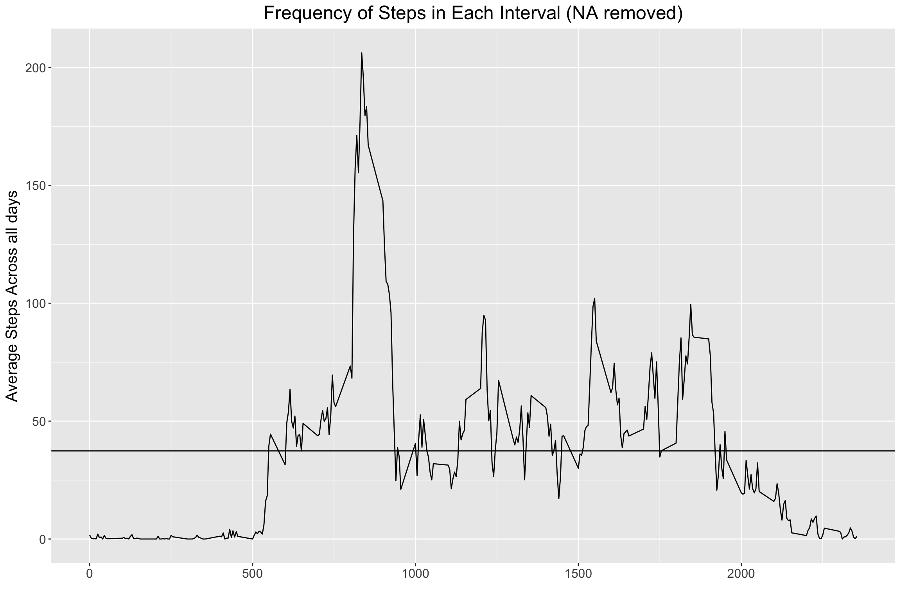

```r
library(ggplot2)
library(scales)
library(Hmisc)
library(scales)
```

## Loading and preprocessing the data
### 1. Load the data
Note that if csv file does not yet exists, the program will unzip the file

```r
if(!file.exists('activity.csv')){
    unzip('activity.zip')
}
data <- read.csv("activity.csv")
```

### 2. View/process data

```r
names(data)
```

```
## [1] "steps"    "date"     "interval"
```

```r
str(data)
```

```
## 'data.frame':	17568 obs. of  3 variables:
##  $ steps   : int  NA NA NA NA NA NA NA NA NA NA ...
##  $ date    : Factor w/ 61 levels "2012-10-01","2012-10-02",..: 1 1 1 1 1 1 1 1 1 1 ...
##  $ interval: int  0 5 10 15 20 25 30 35 40 45 ...
```

```r
head(data)
```

```
##   steps       date interval
## 1    NA 2012-10-01        0
## 2    NA 2012-10-01        5
## 3    NA 2012-10-01       10
## 4    NA 2012-10-01       15
## 5    NA 2012-10-01       20
## 6    NA 2012-10-01       25
```

```r
head(data[which(!is.na(data$steps)), ]) # data set with NA rows removed
```

```
##     steps       date interval
## 289     0 2012-10-02        0
## 290     0 2012-10-02        5
## 291     0 2012-10-02       10
## 292     0 2012-10-02       15
## 293     0 2012-10-02       20
## 294     0 2012-10-02       25
```

Convert factor to date

```r
data$date <- as.Date(data$date, format = "%Y-%m-%d")
str(data)
```

```
## 'data.frame':	17568 obs. of  3 variables:
##  $ steps   : int  NA NA NA NA NA NA NA NA NA NA ...
##  $ date    : Date, format: "2012-10-01" "2012-10-01" ...
##  $ interval: int  0 5 10 15 20 25 30 35 40 45 ...
```

## What is mean total number of steps taken per day?
### 1. Calculate the total number of steps taken per day

Number of steps need to be grouped by date and intervals. Remove NA


```r
dailySteps <- aggregate(steps ~ date, data, sum, na.rm = TRUE)
```

Total steps on each day (showing first 6 days):

```r
head(dailySteps)
```

```
##         date steps
## 1 2012-10-02   126
## 2 2012-10-03 11352
## 3 2012-10-04 12116
## 4 2012-10-05 13294
## 5 2012-10-06 15420
## 6 2012-10-07 11015
```
### 2. Histogram of the total number of steps taken each day
Histogram:

```r
qplot(dailySteps$steps, xlab='Total steps per day', ylab='Frequency of Steps') +
    ggtitle("Distribution of Daily total (NA removed)") + 
    theme(text = element_text(size=15), plot.title = element_text(hjust=0.5))
```

<!-- -->

I want to add a bar plot:

```r
ggplot(dailySteps, aes(x=date, y=steps)) +
  geom_bar(stat="identity") + ylab ("Frequency of Steps") + xlab("Date") +
    ggtitle("Histogram of Total Number of Steps (NA removed)") + 
    theme(text = element_text(size=15), plot.title = element_text(hjust=0.5))
```

<!-- -->

### 3. Mean and median number of steps taken each day

The mean and median total of steps per day can be found below:

```r
summary(dailySteps$steps)
```

```
##    Min. 1st Qu.  Median    Mean 3rd Qu.    Max. 
##      41    8841   10760   10770   13290   21190
```

#### 3.1 Mean

```r
paste("Mean Steps per day =", mean(dailySteps$steps, na.rm=TRUE))
```

```
## [1] "Mean Steps per day = 10766.1886792453"
```

#### 3.2 Median

```r
paste("Median Steps per day =", median(dailySteps$steps, na.rm=TRUE))
```

```
## [1] "Median Steps per day = 10765"
```

## Time series plot of the average number of steps taken
### 1. Make a time series plot of the 5-minute interval (x-axis) and the average number of steps taken, averaged across all days (y-axis)

ggplot2:

```r
avgSteps5 <- aggregate(steps ~ interval, data, mean)

ggplot(avgSteps5, aes(interval, steps)) + geom_line() +
  xlab("") + ylab("Average Steps Across all days") + 
    ggtitle("Frequency of Steps in Each Interval (NA removed)") + 
    theme(text = element_text(size=15), plot.title = element_text(hjust=0.5)) +
    geom_hline(yintercept=mean(avgSteps5$steps, na.rm=TRUE))
```

<!-- -->

base plot

```r
plot(avgSteps5$interval, avgSteps5$steps, type="l", main="Frequency of Steps in Each Interval (NA removed)",
     xlab="", ylab="Steps", col="black", lwd=2)
abline(h=mean(avgSteps5$steps, na.rm=TRUE), col="black", lwd=2)
```

<!-- -->

## 2.The 5-minute interval that, on average, contains the maximum number of steps
Check wich 5-minute interval contains the max number of steps:


```r
max_steps <- max(avgSteps5$steps)
ans5 = avgSteps5[avgSteps5$steps == max_steps, ]
names(ans5)
```

```
## [1] "interval" "steps"
```

Most steps is 206.1698113 at interval 835

<!-- Compute the average step per day -->
<!-- generate the time series plot -->

<!-- # ```{r, echo = TRUE} -->
<!-- avgSteps <- aggregate(steps ~ date, data, mean) -->

<!-- ggplot(avgSteps, aes(date, steps)) + geom_line() + -->
  <!-- xlab("Date") + ylab("Average Steps per day") + -->
    <!-- ggtitle("Frequency of Steps in Each Day (NA removed)") +  -->
    <!-- theme(text = element_text(size=15), plot.title = element_text(hjust=0.5)) -->
<!-- ``` -->

## Imputing missing data
### 1. Calculate and report the total number of missing values in the dataset 

```r
totNA <- sum(is.na(data$steps))
```
Total number os missing values is 2304

### 2. Devise a strategy for filling in all of the missing values in the dataset. 

NA will replaced with the mean. If the mean of the steps is y for a considered time interval, all NA for this specific time interval will be replaced with the mean.

The daily steps will be recalculated in order to verify how much they differ (if they do) from the original data

### 3. Create a new dataset that is equal to the original dataset but with the missing data filled in.
Create new dataframe with NA filled in


```r
data_impute <- data
i_data <- is.na(data_impute$steps)
data_ign <- subset(data, !is.na(data$steps))
steps_avg <- tapply(data_ign$steps, data_ign$interval, mean, na.rm=TRUE, simplify=TRUE)
data_impute$steps[i_data] <- steps_avg[as.character(data_impute$interval[i_data])]
```

### 4. Make a histogram of the total number of steps taken each day and Calculate and report the mean and median total number of steps taken per day. 


```r
impute_dailysum <- tapply(data_impute$steps, data_impute$date, sum, na.rm=TRUE, simplify=T)

hist(x=impute_dailysum,
     col="gray90",
     breaks = 50,
     xlab="daily steps",
     ylab="Frequency",
     main="Distribution of Daily Total (Imputed NA)")
```

<!-- -->

#### Mean

```r
paste("Mean Steps per day, NA imputed=", mean(impute_dailysum))
```

```
## [1] "Mean Steps per day, NA imputed= 10766.1886792453"
```

#### Median

```r
paste("Median Steps per day, NA imputed =", median(impute_dailysum))
```

```
## [1] "Median Steps per day, NA imputed = 10766.1886792453"
```

#### 4.1 Do these values differ from the estimates from the first part of the assignment? 

```r
paste("Mean Steps per day, all data =", mean(dailySteps$steps))
```

```
## [1] "Mean Steps per day, all data = 10766.1886792453"
```


```r
paste("Mean Steps per day, NA removed =", mean(dailySteps$steps, na.rm=TRUE))
```

```
## [1] "Mean Steps per day, NA removed = 10766.1886792453"
```


```r
paste("Mean Steps per day, NA imputed =", mean(impute_dailysum))
```

```
## [1] "Mean Steps per day, NA imputed = 10766.1886792453"
```


```r
paste("Median Steps per day, all data =", median(dailySteps$steps))
```

```
## [1] "Median Steps per day, all data = 10765"
```


```r
paste("Median Steps per day, NA removed =", median(dailySteps$steps, na.rm=TRUE))
```

```
## [1] "Median Steps per day, NA removed = 10765"
```


```r
paste("Median Steps per day, NA imputed =", median(impute_dailysum))
```

```
## [1] "Median Steps per day, NA imputed = 10766.1886792453"
```

The difference in results beteween the original dataset and the imputed dataset for the mean and median is only 1.2% and 2.3%, respectively.

Upon checking the histograms, max steps have increased by using the imputed data.

#### 4.2 What is the impact of imputing missing data on the estimates of the total daily number of steps?

I now have higher frequency counts in the histogram.

## Are there differences in activity patterns between weekdays and weekends?
